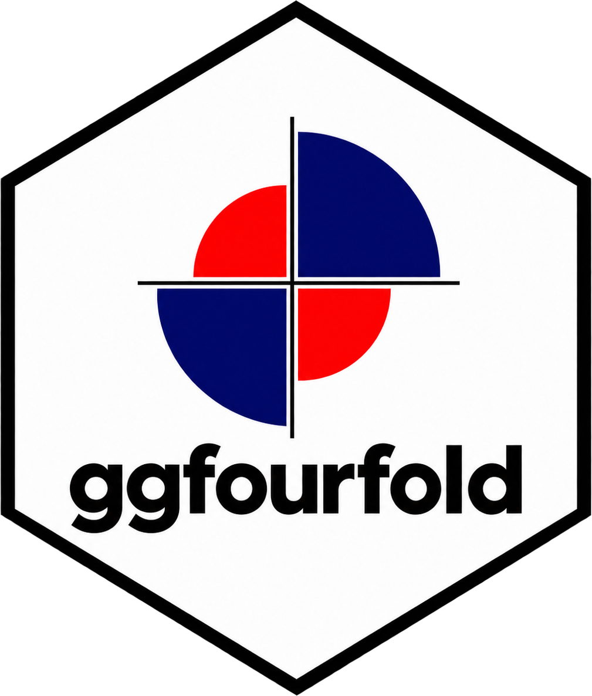
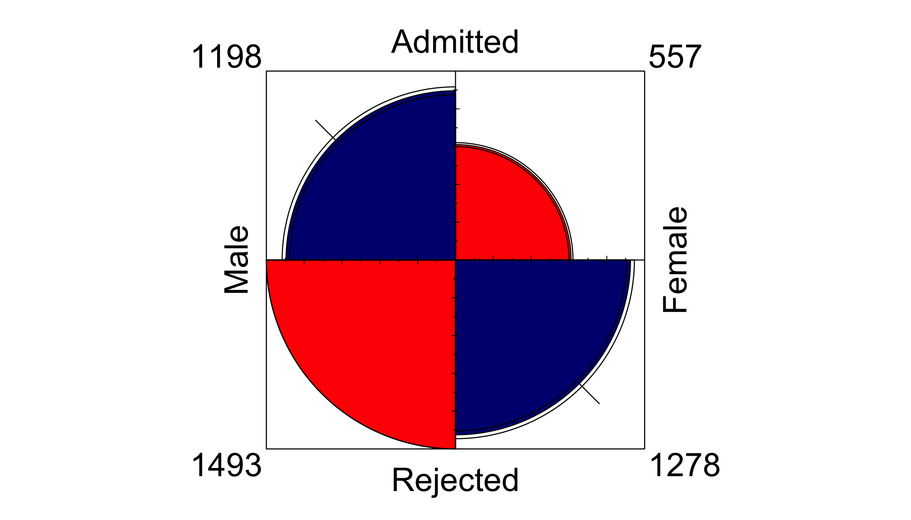
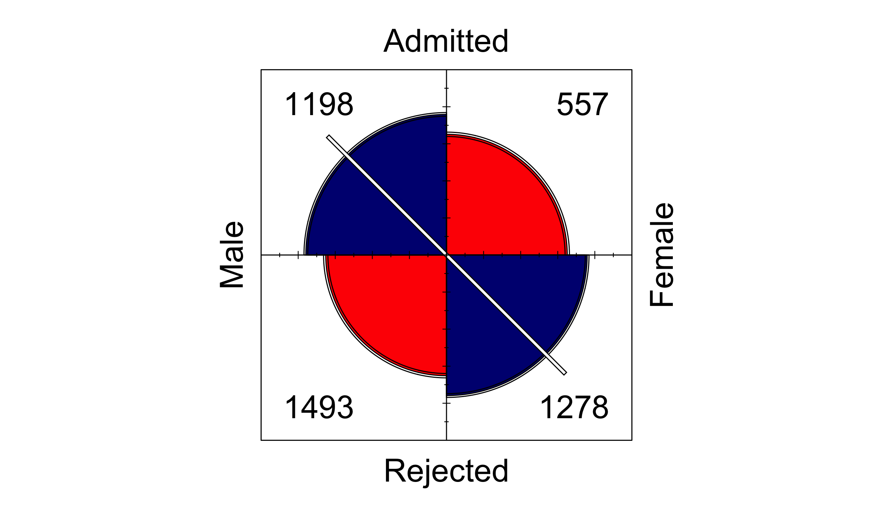

<!-- README.md is generated from README.Rmd. Please edit README.Rmd. -->

<!-- badges: start -->

[](https://lifecycle.r-lib.org/articles/stages.html#experimental)
[](https://github.com/gklorfine/ggfourfold)
[](https://gavinklorfine.com/ggfourfold/)
<!-- badges: end -->

# ggfourfold <br><sub>Fourfold Displays for ‘ggplot2’</sub>

***Package is a work in progress. Functionality may not work as
intended.***

A `ggplot2` extension that provides a geom and theme for creating
fourfold displays. Inspired by the `fourfold` SAS macro (Friendly, 2000)
and `vcd` R package (Meyer et al., 2026).

## Installation

Install the latest version of `ggfourfold` from GitHub with:

``` r
# install.packages("pak")
pak::pak("gklorfine/ggfourfold")
```

## Overview

A fourfold display (Friendly, 1994) is a visualization of a $2 \times 2$
table, or $2 \times 2 \times k$ tables via faceting. It consists of a
circle that is split into quadrants, giving a segment for each cell in
the table. In an **unstandardized** display, these quadrants have area
proportional to the sample size of their corresponding cell.
**Standardized** displays … This helps with / affords / … and gives a
visual interpretation of the odds ratio, …

<!-- expand on overview... -->

## Examples

``` r
library(ggfourfold)
library(ggplot2)
```

``` r
ucb <- as.data.frame(UCBAdmissions)

ggplot(ucb, aes(x = Gender, y = Admit, weight = Freq)) +
  geom_fourfold(std = "ind.max") +  # For unstandardized display
  theme_fourfold()
```

<!-- -->

``` r
ucb <- as.data.frame(UCBAdmissions)

ggplot(ucb, aes(x = Gender, y = Admit, weight = Freq)) +
  geom_fourfold() +
  theme_fourfold()
```

<!-- -->

``` r
ggplot(ucb, aes(x = Gender, y = Admit, weight = Freq)) +
  geom_fourfold() +
  facet_wrap(vars(Dept), labeller = label_both) +
  theme_fourfold()
```

<!-- -->

Quarter-squares can be drawn instead of quarter-circles with
`shape = "square"`. Each square has the same area as the quarter-circle
it replaces, so both shapes display a table with identical areas.
Squares and their diagonal direction ticks can reach the corners of the
frame where the cell counts are drawn; when they do in any panel, as
here, the counts in every panel move just outside those corners.

``` r
ggplot(ucb, aes(x = Gender, y = Admit, weight = Freq)) +
  geom_fourfold(shape = "square") +
  facet_wrap(vars(Dept), labeller = label_both) +
  theme_fourfold()
```

<!-- -->

## References

<div id="refs" class="references csl-bib-body hanging-indent"
data-entry-spacing="0" data-line-spacing="2">

<div id="ref-Friendly:94:TR217" class="csl-entry">

Friendly, M. (1994). *A fourfold display for 2 by 2 by $k$ tables* 
(217). York University, Psychology Dept.
<http://datavis.ca/papers/4fold/4fold.pdf>

</div>

<div id="ref-vcd:Friendly:2000" class="csl-entry">

Friendly, M. (2000). *Visualizing categorical data*.
<span class="sans-serif">SAS</span> Insitute.
<http://www.math.yorku.ca/SCS/vcd/>

</div>

<div id="ref-vcd:package" class="csl-entry">

Meyer, D., Zeileis, A., Hornik, K., & Friendly, M. (2026). *Vcd:
Visualizing categorical data*.
<https://doi.org/10.32614/CRAN.package.vcd>

</div>

</div>
