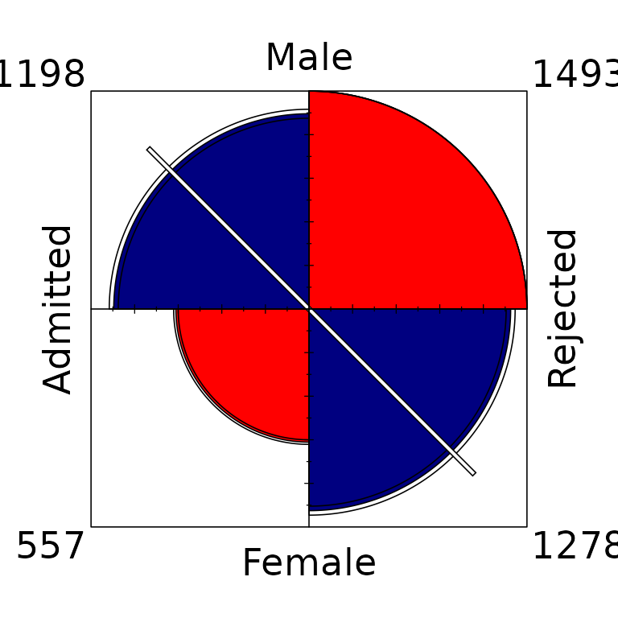
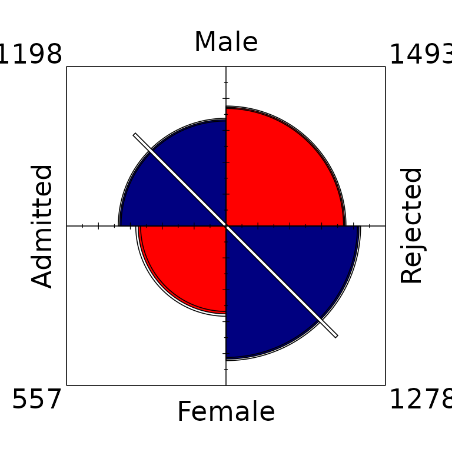
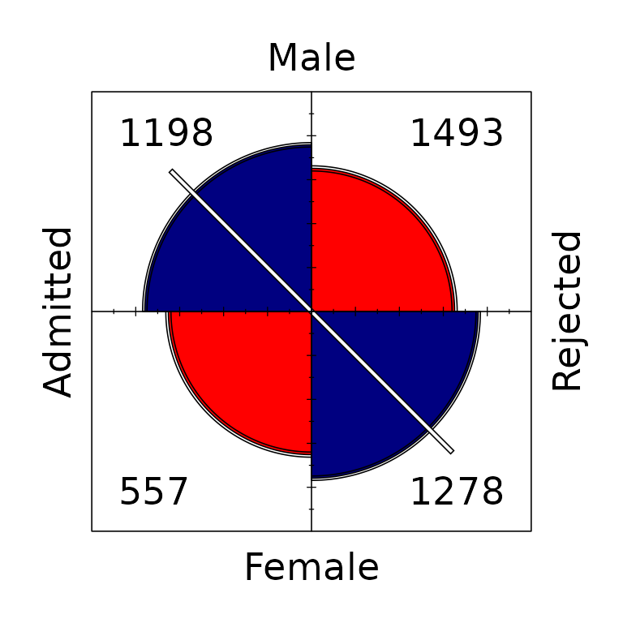
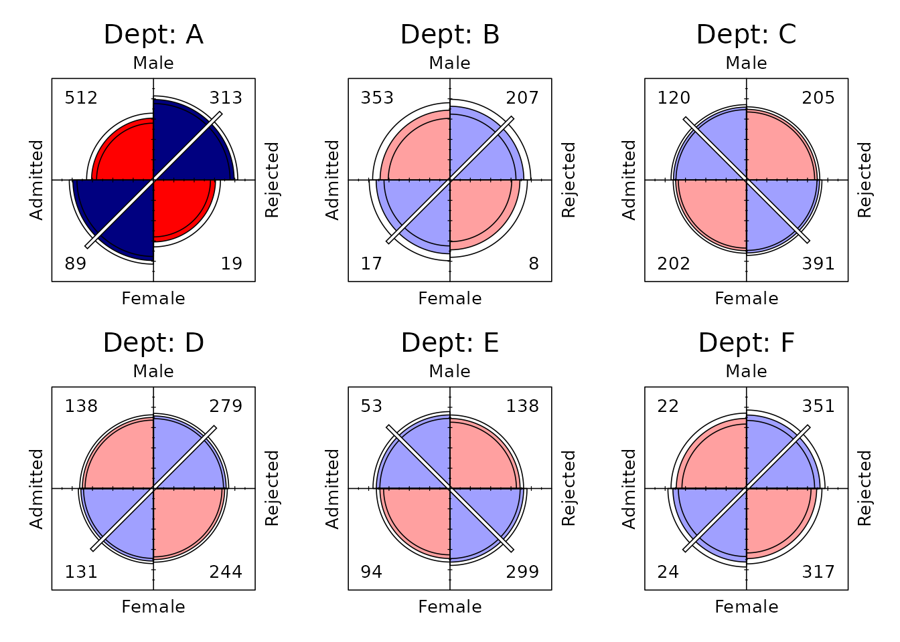
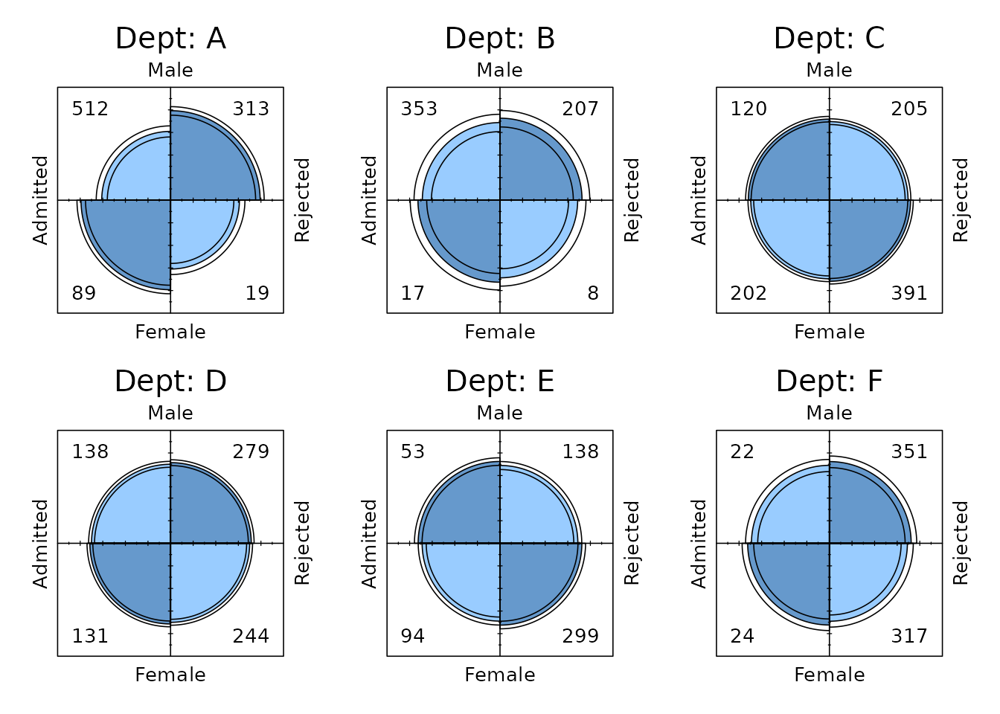
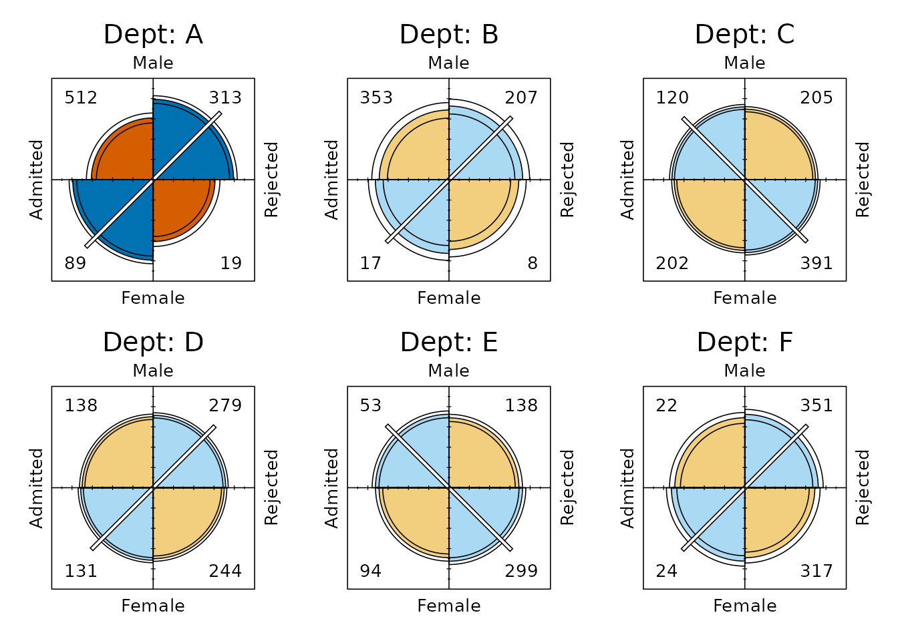
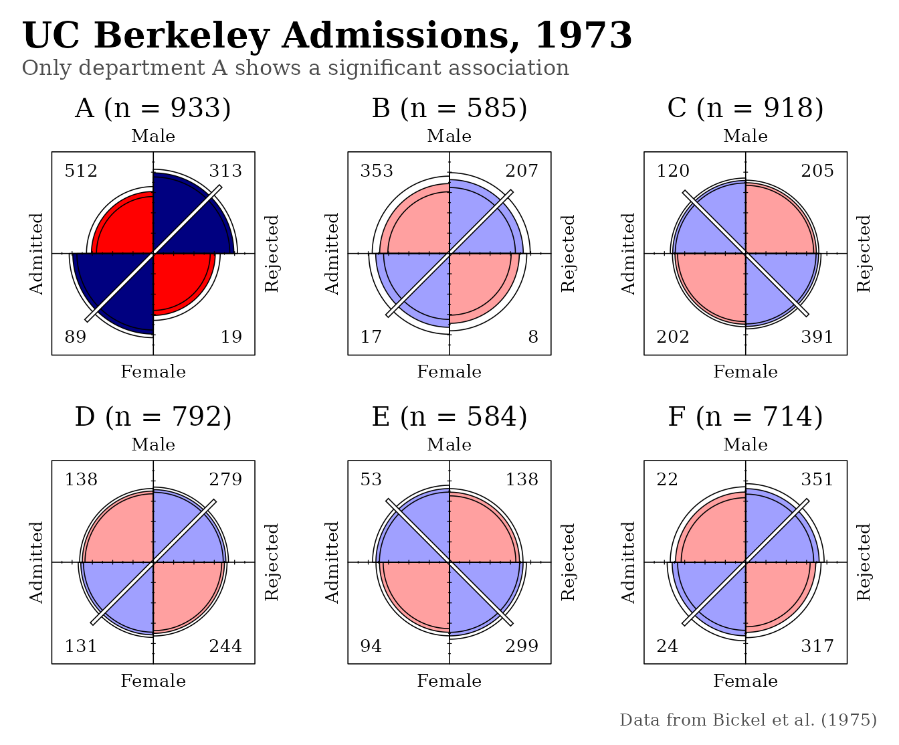

# Fourfold Displays for 'ggplot2'

``` r

library(ggfourfold)
library(ggplot2)
```

`ggfourfold` provides
[`geom_fourfold()`](https://gavinklorfine.com/ggfourfold/reference/geom_fourfold.md)
and
[`theme_fourfold()`](https://gavinklorfine.com/ggfourfold/reference/theme_fourfold.md)
for drawing fourfold displays of \\2 \times 2\\ and \\2 \times 2 \times
k\\ tables with `ggplot2` to show the **direction** and **strength** of
association between two binary variables, and its **pattern** of
association across \\k\\ strata.

For example, in the classic case we use here, one could ask if there is
an association between gender and admission to graduate school, and
whether this association varies across the departments applied to. This
introduction follows the treatment in Friendly & Meyer (2016, Section
4.4).

## Fourfold displays

The *fourfold display* is a special case of a **radial diagram**, or
“polar area chart”, designed for \\2 \times 2\\ (or \\2 \times 2 \times
k\\) tables (Fienberg, 1975; Friendly, 1994a, 1994b). The frequency
\\n\_{ij}\\ in each cell is shown by a quarter circle whose radius is
proportional to \\\sqrt{n\_{ij}}\\, so that its *area* is proportional
to the cell count.

Like a pie chart, it uses segments of a circle to show frequencies;
unlike a pie chart, it keeps the angles of the segments constant and
varies the radius. This is the \\2 \times 2\\ cousin of the graphic form
used by Florence Nightingale (Nightingale, 1858). Friendly & Andrews
(2021) describe the rich history of radial diagrams.

The main purpose of the display is to show the **sample odds ratio**.
This gives a number that compares the odds of an event (accepted!)
happening in one group (men) to the odds of it happening in another
group (women).

\\ \hat{\theta} = \frac{n\_{11} / n\_{12}}{n\_{21} / n\_{22}} =
\frac{n\_{11} \\ n\_{22}}{n\_{12} \\ n\_{21}} . \\

An association between the two variables (\\\theta \neq 1\\) appears as
a tendency for one pair of diagonally opposite cells to be larger than
the other pair. The fourfold plot shows the association and the odds
ratio visually as follows:

- **Color and a diagonal line** show the **direction of association**:
  the relatively larger diagonal pair is drawn in blue (more than
  expected under independence) with a line through the center along that
  diagonal, and the other pair in red.

- **Confidence rings** around each quadrant give a **visual test of
  independence**, \\H_0: \theta = 1\\: in a standardized display, the
  rings for adjacent quadrants overlap if and only if the observed
  counts are consistent with the null hypothesis.

## Example: Berkeley admissions

The classic example, `UCBAdmissions` gives applicants to the six largest
graduate departments at Berkeley in 1973, classified by admission and
gender (Bickel et al., 1975).
[`geom_fourfold()`](https://gavinklorfine.com/ggfourfold/reference/geom_fourfold.md)
currently works on data in *long form*: map the two-level variables to
`x` (drawn left to right) and `y` (drawn top to bottom), and the cell
frequencies to `weight`. Without faceting, rows for the same cell are
summed, so this pools over departments:

``` r

ucb <- as.data.frame(UCBAdmissions)
berkeley <- ggplot(ucb, aes(x = Admit, y = Gender, weight = Freq)) +
  theme_fourfold()
```

The *unstandardized* display (`std = "ind.max"`) shows the raw
frequencies, with the largest cell drawn at full size. The sample odds
ratio, Odds(Admit \| Male) / Odds(Admit \| Female), is \\(1198 / 1493) /
(557 / 1278) = 1.84\\: male applicants were nearly twice as likely to be
admitted.

``` r

berkeley + geom_fourfold(std = "ind.max")
```



These comparisons are difficult because there are more male applicants
than female, and because more applicants were rejected than admitted. In
the unstandardized display the confidence rings have no interpretation
as a test of \\H_0: \theta = 1\\.

The data can be standardized to make the comparison easier while
preserving the odds ratio. With `margin = 1` the rows (here, `Gender`)
are equated, so each quadrant shows the proportion of men or women who
were admitted or rejected: 44.5% of male applicants were admitted,
compared with 30.4% of female applicants. Now the rings for each upper
quadrant overlap those of the quadrant below it if the odds ratio does
not differ from 1.

``` r

berkeley + geom_fourfold(margin = 1)
```



The default, `margin = c(1, 2)`, standardizes *both* margins. The four
quadrants then align horizontally and vertically when the odds ratio is
1, regardless of the marginal frequencies, so the association between
admission and gender can be seen without the influence of the overall
admission rate or of the numbers of men and women who applied. This
fully standardized display is usually the most useful form.

``` r

berkeley + geom_fourfold()
```



The quadrants do not align, and the 95% confidence rings, computed from
the interval \\1.62 \le \theta \le 2.09\\, do not overlap: the odds
ratio differs significantly from 1, apparent evidence of gender bias in
favor of men.

## Stratified \\2 \times 2 \times k\\ tables

In a \\2 \times 2 \times k\\ table the third variable often defines
strata, and the question is whether the association between the first
two is the same in each stratum. Make one fourfold display per stratum
with
[`facet_wrap()`](https://ggplot2.tidyverse.org/reference/facet_wrap.html)
or
[`facet_grid()`](https://ggplot2.tidyverse.org/reference/facet_grid.html);
standardizing the margins within each panel allows the pattern of
association to be compared across strata even when their marginal
frequencies differ.

``` r

berkeley +
  geom_fourfold() +
  facet_wrap(vars(Dept), ncol = 3, labeller = label_both)
```



Surprisingly, for five of the six departments the odds of admission are
about the same for men and women. Only Department A differs, and in the
opposite direction: there women were about 2.86 times as likely as men
to be admitted (\\1 / 0.349\\). The more intense colors mark the one
panel whose odds ratio differs significantly from 1. With several
strata,
[`geom_fourfold()`](https://gavinklorfine.com/ggfourfold/reference/geom_fourfold.md)
adjusts the p-values that control this emphasis for multiple testing, by
default using Holm’s method via
[`stats::p.adjust()`](https://rdrr.io/r/stats/p.adjust.html); the
confidence rings themselves are not adjusted.

This reversal of the aggregate result is an example of Simpson’s
paradox, and it shows why an analysis of a table collapsed over a third
variable can mislead. Men and women applied to departments in different
proportions, and women applied in greater numbers to departments with
low admission rates.

Because a fourfold display keeps the angle of each cell fixed,
corresponding cells are always in the same position in every panel. An
array of fourfold displays therefore supports *controlled comparison*,
against a standard with other things held constant, much better than an
array of pie charts. Standardizing the margins adds a further standard
for comparison while preserving the odds ratio, the quantity the display
is designed to show.

## Confidence rings

Each quadrant of a fourfold display is drawn with a pair of thin rings,
one just inside and one just outside its edge. Together they show the
range of tables that are consistent with the data at the confidence
level given by `conf_level` (0.95 by default). They are constructed in
three steps.

**1. An interval for the odds ratio.** Inference is simplest on the log
scale. The log odds ratio, \\\hat{\psi} = \log \hat{\theta}\\, has an
approximate standard error

\\ \hat{s}(\hat{\psi}) = \sqrt{\frac{1}{n\_{11}} + \frac{1}{n\_{12}} +
\frac{1}{n\_{21}} + \frac{1}{n\_{22}}} , \\

so an approximate \\1 - \alpha\\ confidence interval for \\\psi\\ is
\\\hat{\psi} \pm z\_{1 - \alpha/2} \\ \hat{s}(\hat{\psi})\\.
Exponentiating its end points, \\\hat{\psi}\_l\\ and \\\hat{\psi}\_u\\,
gives the interval \\\\\exp(\hat{\psi}\_l), \exp(\hat{\psi}\_u)\\\\ for
\\\theta\\. (If any cell is zero, 0.5 is first added to every cell, as
in [`vcd::fourfold()`](https://rdrr.io/pkg/vcd/man/fourfold.html).) For
the pooled Berkeley data, \\\hat{\psi} = 0.610\\ and \\\hat{s} =
0.0639\\, so the 95% interval for the odds ratio runs from 1.624 to
2.087.

**2. A table for each end of the interval.** Each limit is turned into
the \\2 \times 2\\ table that has that odds ratio. When both margins are
equated, such a table has the symmetric form

\\ \begin{bmatrix} p & 1 - p \\ 1 - p & p \end{bmatrix} , \\

whose odds ratio is \\\theta = p^2 / (1 - p)^2\\. Solving for \\p\\
gives \\p = \sqrt{\theta} / (1 + \sqrt{\theta})\\. More generally, the
table can be found that keeps the observed row and column totals and has
the required odds ratio; with the margins fixed, the whole table follows
from a single cell, which is the root of a quadratic equation.

**3. Draw the tables like the data.** Each limiting table is
standardized in the same way as the observed table (`std`, `margin`) and
drawn as outlines over the quadrants. For the Berkeley data this gives:

|  | Odds ratio | \\p\\ | Male, admitted | Male, rejected | Female, admitted | Female, rejected |
|:---|---:|---:|---:|---:|---:|---:|
| Lower 95% limit | 1.624 | 0.560 | 1167.1 | 1523.9 | 587.9 | 1247.1 |
| Observed | 1.841 | 0.576 | 1198 | 1493 | 557 | 1278 |
| Upper 95% limit | 2.087 | 0.591 | 1228.4 | 1462.6 | 526.6 | 1308.4 |

Every row has the observed margins, 2691 male and 1835 female
applicants, of whom 1755 were admitted. Only the balance among the cells
changes.

### Reading the rings

The distance between the rings of a quadrant shows the precision of the
estimate: large samples give narrow rings, like those for the pooled
Berkeley data above, and small samples give wide ones.

More usefully, the rings give a visual test of independence, \\H_0:
\theta = 1\\. When both margins are equated, independence corresponds to
\\p = 1/2\\, so all four quadrants would have the same radius. If the
confidence interval for \\\theta\\ includes 1, that table of equal
quadrants lies between the rings, and the rings of each pair of adjacent
quadrants overlap. If the interval excludes 1, the rings of adjacent
quadrants are separated. For the pooled Berkeley data, they are clearly
separated.

How much of this reading holds depends on the standardization:

- With both margins equated (the default), the test applies in both
  directions, between horizontally and vertically adjacent quadrants.
- With `margin = 1`, only the rows are equated. The rings of each upper
  quadrant and the quadrant below it overlap if and only if the interval
  includes 1; nothing can be said about quadrants side by side, because
  the column totals have not been equated.
- In an unstandardized display (`std = "ind.max"` or `"all.max"`), the
  rings still show the precision of each cell, but their overlap is not
  a test of \\H_0\\.

With several strata, each panel’s rings show that stratum’s own interval
at `conf_level`. They are not adjusted for multiple comparisons, as is
also the case in
[`vcd::fourfold()`](https://rdrr.io/pkg/vcd/man/fourfold.html). Only the
*p*-values that decide which panels are drawn in the more intense colors
are adjusted (Holm’s method, by default). A stratum whose rings only
just separate can therefore still be drawn in the paler colors. Set
`conf_level = 0` to omit the rings.

## Customizing the display

### Square cells

`ggfourfold` allows for four squares to be drawn instead of
quarter-circles via the `shape` argument of
[`geom_fourfold()`](https://gavinklorfine.com/ggfourfold/reference/geom_fourfold.md).
Squares are drawn with area equal to the quarter-circle they replace
(side \\r\sqrt{\pi}/2\\ for radius \\r\\), and confidence rings become
square outlines that are read in the same way.

``` r

berkeley +
  geom_fourfold(shape = "square") +
  facet_wrap(vars(Dept), ncol = 3, labeller = label_both)
```


### Cell counts

By default, raw cell counts are pictured in the inside corners of each
display’s frame; however, if the drawing of quarter-circles (or squares)
comes close to overlapping these counts, they are displayed just outside
the frame of each display.

To fix the placement, supply `counts = "inside"` or `counts = "outside"`
to
[`geom_fourfold()`](https://gavinklorfine.com/ggfourfold/reference/geom_fourfold.md).
`counts = "none"` hides them, while the default, automatic placement
uses `counts = "auto"`.

``` r

berkeley +
  geom_fourfold(shape = "square", counts = "outside") +
  facet_wrap(vars(Dept), ncol = 3, labeller = label_both)
```


### Colors

Displays are *extended* by default: each stratum is shaded by the
significance of its association, as in the Berkeley examples above, and
a diagonal line is drawn through the center, along the diagonal with
more cases than expected. If `extended = FALSE` is supplied to
[`geom_fourfold()`](https://gavinklorfine.com/ggfourfold/reference/geom_fourfold.md),
every panel is shaded alike, with the larger diagonal being darker.
Significance is not shown and the diagonal line is omitted, giving a
simpler display. To keep the shading and omit only the line, supply
`diagonal = FALSE`; its length, interior color, and width can be changed
with `diagonal.length`, `diagonal.fill`, and `diagonal.width`.

``` r

berkeley +
  geom_fourfold(extended = FALSE) +
  facet_wrap(vars(Dept), ncol = 3, labeller = label_both)
```



Since colors carry the display’s meaning, they are drawn directly
through the `geom` rather than mapped through a fill scale.
[`scale_fill_manual()`](https://ggplot2.tidyverse.org/reference/scale_manual.html)
and similar functions therefore have no effect. Supply them through the
`palette` argument instead, as a vector of six colors in the same order
used by
[`fourfold_palette()`](https://gavinklorfine.com/ggfourfold/reference/fourfold_palette.md).

``` r

fourfold_palette()
#> [1] "#99CCFF" "#6699CC" "#FFA0A0" "#A0A0FF" "#FF0000" "#000080"
```

The six colors form three pairs:

- Colors 1–2 are used when `extended = FALSE`
- Colors 3–4 are used for a stratum whose association is not significant
- Colors 5–6 are used for a stratum whose association is significant
  after adjustment

Within each pair, the first color fills the diagonal with *fewer* cases
than expected under independence and the second fills the diagonal with
*more*.

For example, we can construct a palette based on the Okabe-Ito colors
(Okabe & Ito, 2008), which remain distinguishable for readers with
common forms of color-deficient vision. Lightened orange and sky blue
mark strata whose association is not significant, while vermillion and
blue mark those whose association is significant.

``` r

okabe_ito <- c(
  "#56B4E9", "#0072B2", # extended = FALSE: sky blue, blue
  "#F2CF7F", "#AAD9F3", # not significant: orange, sky blue (lightened)
  "#D55E00", "#0072B2"  # significant: vermillion, blue
)

berkeley +
  geom_fourfold(palette = okabe_ito) +
  facet_wrap(vars(Dept), ncol = 3, labeller = label_both)
```



This palette is also built into `ggfourfold`, so the same display can be
drawn with `fourfold_palette("okabe-ito")`.

``` r

berkeley +
  geom_fourfold(palette = fourfold_palette("okabe-ito")) +
  facet_wrap(vars(Dept), ncol = 3, labeller = label_both)
```

### Working with ‘ggplot2’

A fourfold display is an ordinary ggplot, so the usual tools for
finishing a figure all apply. Below,
[`ggplot2::labs()`](https://ggplot2.tidyverse.org/reference/labs.html)
adds a title that states the finding and adds a caption giving the
source of the data. Additionally, the facet labeller adds the number of
applicants to each panel, which makes the departments easy to compare
without needing to add up their cell counts.

The text drawn by
[`geom_fourfold()`](https://gavinklorfine.com/ggfourfold/reference/geom_fourfold.md)
itself, such as the category labels and cell counts, follows the
`base_size` and `base_family` of
[`theme_fourfold()`](https://gavinklorfine.com/ggfourfold/reference/theme_fourfold.md),
meaning that a single argument changes the font of the whole figure. If
more control is needed, other theme settings can be passed through the
`...` of
[`theme_fourfold()`](https://gavinklorfine.com/ggfourfold/reference/theme_fourfold.md)
or added with
[`ggplot2::theme()`](https://ggplot2.tidyverse.org/reference/theme.html)
as usual.

``` r

applicants <- margin.table(UCBAdmissions, 3)
dept_labels <- sprintf("%s (n = %d)", names(applicants), applicants)
names(dept_labels) <- names(applicants)

ggplot(ucb, aes(x = Admit, y = Gender, weight = Freq)) +
  geom_fourfold() +
  facet_wrap(vars(Dept), ncol = 3, labeller = labeller(Dept = dept_labels)) +
  labs(
    title = "UC Berkeley Admissions, 1973",
    subtitle = "Only department A shows a significant association",
    caption = "Data from Bickel et al. (1975)"
  ) +
  theme_fourfold(base_family = "serif") +
  theme(
    plot.title.position = "plot",
    plot.title = element_text(hjust = 0),
    plot.subtitle = element_text(
      hjust = 0,
      colour = "grey30",
      margin = margin(b = 10)
    ),
    plot.caption = element_text(
      hjust = 1,
      colour = "grey30",
      size = rel(0.8),
      margin = margin(t = 10)
    )
  )
```



## References

Bickel, P. J., Hammel, J. W., & O’Connell, J. W. (1975). Sex bias in
graduate admissions: Data from Berkeley. *Science*, *187*, 398–403.

Fienberg, S. E. (1975). Perspective Canada as a social report. *Social
Indicators Research*, *2*, 153–174.

Friendly, M. (1994a). *A fourfold display for 2 by 2 by \\k\\ tables*
(No. 217). York University, Psychology Dept.
<http://datavis.ca/papers/4fold/4fold.pdf>

Friendly, M. (1994b). SAS/IML graphics for fourfold displays.
*Observations*, *3*(4), 47–56.

Friendly, M., & Andrews, R. (2021). The radiant diagrams of Florence
Nightingale. *SORT*, *45*(1). <https://doi.org/10.2436/20.8080.02.106>

Friendly, M., & Meyer, D. (2016). *Discrete data analysis with R:
Visualization and modeling techniques for categorical and count data*.
Chapman & Hall/CRC. <http://ddar.datavis.ca>

Nightingale, F. (1858). *Notes on matters affecting the health,
efficiency, and hospital administration of the British army*. Harrison
and Sons. <https://archive.org/details/b20387118>

Okabe, M., & Ito, K. (2008). *Color Universal Design (CUD): How to make
figures and presentations that are friendly to colorblind people*.
<https://jfly.uni-koeln.de/color/>
