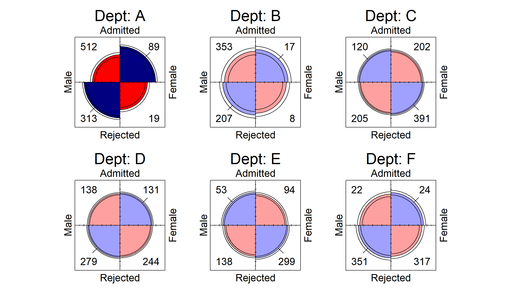
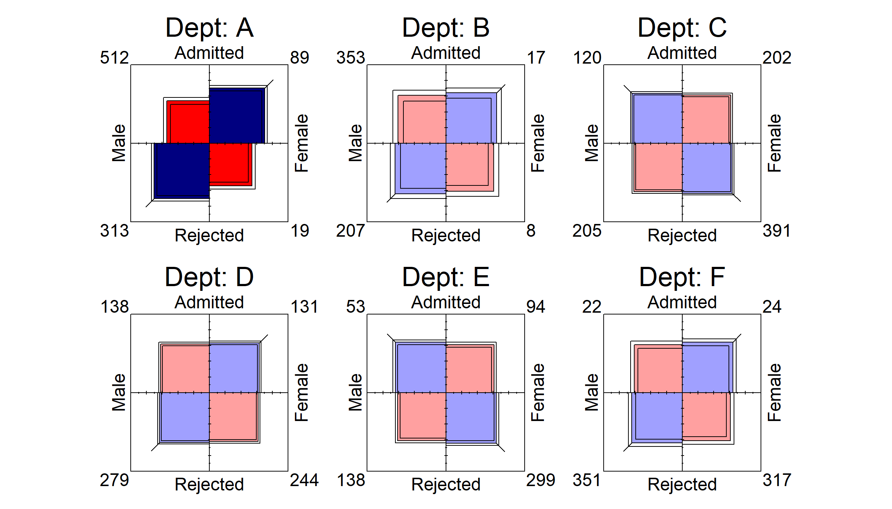

# ggfourfold _(Fourfold Displays for ‘ggplot2’)

***Package is a work in progress. Functionality may not work as
intended.***

A `ggplot2` extension that provides a geom and theme for creating
fourfold displays. Inspired by the `fourfold` SAS macro (Friendly, 2000)
and `vcd` R package (Meyer et al., 2026).

## Installation

Install the latest version of `ggfourfold` from GitHub with:

``` r

# install.packages("pak")
pak::pak("gklorfine/ggfourfold")
```

## Overview

A fourfold display (Friendly, 1994; Friendly & Meyer, 2016, Section 4.4)
is a visualization of a \\2 \times 2\\ table, or \\2 \times 2 \times k\\
tables via faceting. It consists of a circle that is split into
quadrants, giving a segment for each cell in the table. Unlike a pie
chart, the angles of the segments are fixed, and it is the radii that
vary.

In an **unstandardized** display, these quadrants have area proportional
to the sample size of their corresponding cell. **Standardized**
displays rescale the table so that the row and/or column totals are
equal, while preserving the sample odds ratio. This helps with comparing
the quadrants when one group is much larger than another. A fully
standardized display (the default) equates both the row *and* column
totals, and gives a visual interpretation of the sample odds ratio:

\\\hat{\theta} = \frac{n\_{11} / n\_{12}}{n\_{21} / n\_{22}}\\

In a fully standardized display, the quadrants form a circle if
\\\hat{\theta} = 1\\. Otherwise, one diagonal pair of quadrants is
larger than the other, with this discrepancy reflecting the strength of
association between variables. The diagonal with more cases than
expected under independence is drawn in blue, with the other pair being
drawn in red. Intense shading is applied when \\\hat{\theta}\\ differs
significantly from 1, after adjusting for multiple testing across
panels. Confidence rings are also drawn, with the rings of adjacent
quadrants overlapping *iff* the 95% confidence interval for \\\theta\\
includes 1.

For more detail on fourfold displays and their use in this package, see
the [introductory
vignette](https://gavinklorfine.com/ggfourfold/articles/ggfourfold.html).

## Examples

The below examples use the `UCBAdmissions` data (Bickel et al., 1975),
which contains applicants to the six largest graduate departments at UC
Berkeley in 1973, classified by admission and gender. They examine the
association between gender and admission, both overall and within each
department.

``` r

library(ggfourfold)
library(ggplot2)
```

``` r

ucb <- as.data.frame(UCBAdmissions)

ggplot(ucb, aes(x = Gender, y = Admit, weight = Freq)) +
  geom_fourfold(std = "ind.max") +  # For unstandardized display
  theme_fourfold()
```


``` r

ucb <- as.data.frame(UCBAdmissions)

ggplot(ucb, aes(x = Gender, y = Admit, weight = Freq)) +
  geom_fourfold() +
  theme_fourfold()
```


``` r

ggplot(ucb, aes(x = Gender, y = Admit, weight = Freq)) +
  geom_fourfold() +
  facet_wrap(vars(Dept), labeller = label_both) +
  theme_fourfold()
```



Quarter-squares can be drawn instead of quarter-circles with
`shape = "square"`. Each square has the same area as the quarter-circle
it replaces, so both shapes display a table with identical areas.
Squares and their diagonal direction ticks can reach the corners of the
frame where the cell counts are drawn; when they do in any panel, as
here, the counts in every panel move just outside those corners.

``` r

ggplot(ucb, aes(x = Gender, y = Admit, weight = Freq)) +
  geom_fourfold(shape = "square") +
  facet_wrap(vars(Dept), labeller = label_both) +
  theme_fourfold()
```



## References

Bickel, P. J., Hammel, J. W., & O’Connell, J. W. (1975). Sex bias in
graduate admissions: Data from Berkeley. *Science*, *187*, 398–403.

Friendly, M. (1994). *A fourfold display for 2 by 2 by \\k\\ tables*
(No. 217). York University, Psychology Dept.
<http://datavis.ca/papers/4fold/4fold.pdf>

Friendly, M. (2000). *Visualizing categorical data*. SAS Insitute.
<http://www.math.yorku.ca/SCS/vcd/>

Friendly, M., & Meyer, D. (2016). *Discrete data analysis with R:
Visualization and modeling techniques for categorical and count data*.
Chapman & Hall/CRC. <http://ddar.datavis.ca>

Meyer, D., Zeileis, A., Hornik, K., & Friendly, M. (2026). *Vcd:
Visualizing categorical data*.
<https://doi.org/10.32614/CRAN.package.vcd>
